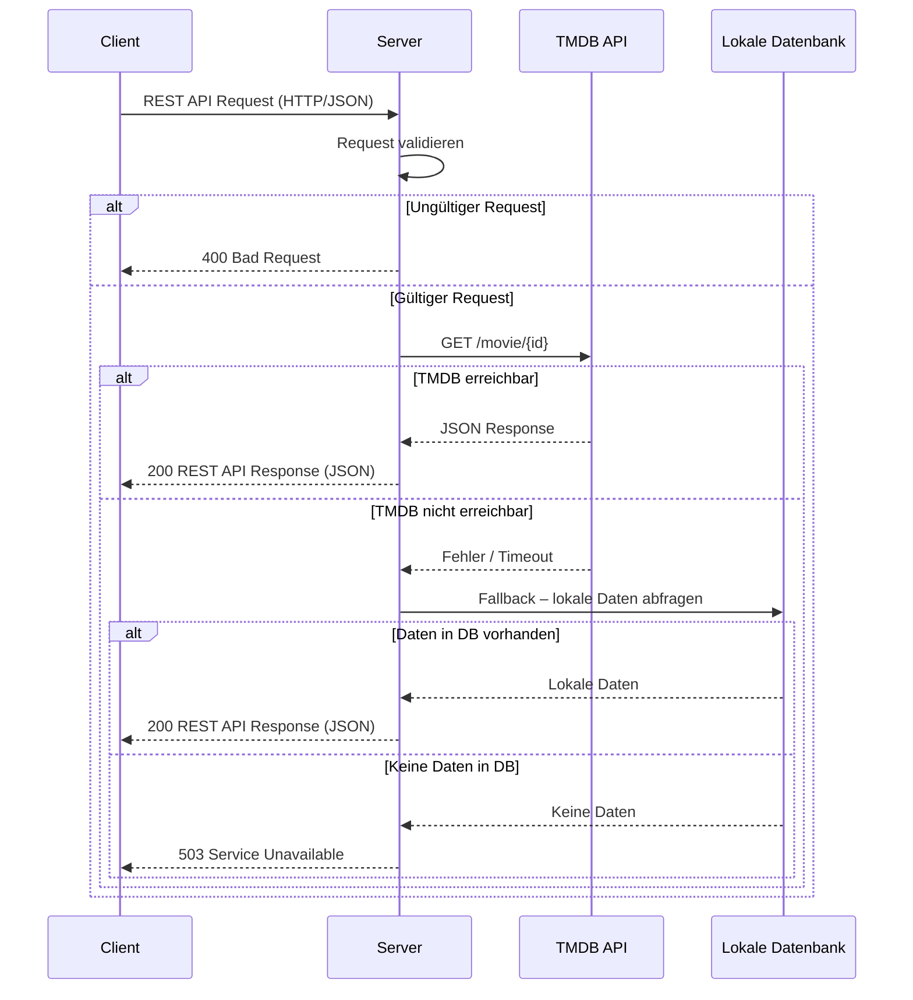

# Architektur

```mermaid
sequenceDiagram
    participant C as Client
    participant S as Server
    participant T as TMDB API
    participant DB as Lokale Datenbank

    C->>S: REST API Request (HTTP/JSON)
    S->>S: Request validieren

    alt Ungültiger Request
        S-->>C: 400 Bad Request
    else Gültiger Request
        S->>T: GET /movie/{id}
        alt TMDB erreichbar
            T-->>S: JSON Response
            S-->>C: 200 REST API Response (JSON)
        else TMDB nicht erreichbar
            T-->>S: Fehler / Timeout
            S->>DB: Fallback – lokale Daten abfragen
            alt Daten in DB vorhanden
                DB-->>S: Lokale Daten
                S-->>C: 200 REST API Response (JSON)
            else Keine Daten in DB
                DB-->>S: Keine Daten
                S-->>C: 503 Service Unavailable
            end
        end
    end
```
