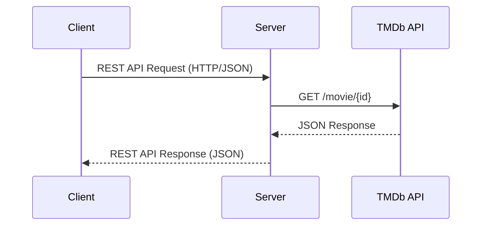

# Architektur

```mermaid
sequenceDiagram
  participant C as Client
  participant S as Server
  participant T as TMDb API

  C->>S: REST API Request (HTTP/JSON)
  S->>T: GET /movie/{id}
  T-->>S: JSON Response
  S-->>C: REST API Response (JSON)
```
