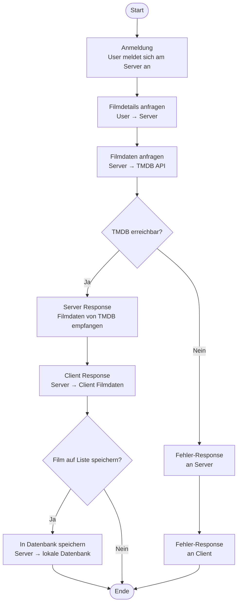
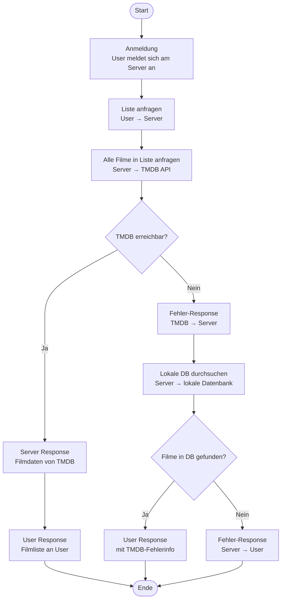

# User fragt Film an

```mermaid
flowchart TD
    A([Start]) --> B[Anmeldung<br/>User meldet sich am Server an]
    B --> C[Filmdetails anfragen<br/>User → Server]
    C --> D[Filmdaten anfragen<br/>Server → TMDB API]
    D --> E{TMDB erreichbar?}
    E -- Ja --> F[Server Response<br/>Filmdaten von TMDB empfangen]
    F --> G[Client Response<br/>Server → Client Filmdaten]
    G --> H{Film auf Liste speichern?}
    H -- Ja --> I[In Datenbank speichern<br/>Server → lokale Datenbank]
    I --> J([Ende])
    H -- Nein --> J
    E -- Nein --> K[Fehler-Response<br/>an Server]
    K --> L[Fehler-Response<br/>an Client]
    L --> J
```

# User möchte seine Liste anschauen

```mermaid
flowchart TD
    A([Start]) --> B[Anmeldung<br/>User meldet sich am Server an]
    B --> C[Liste anfragen<br/>User → Server]
    C --> D[Alle Filme in Liste anfragen<br/>Server → TMDB API]
    D --> E{TMDB erreichbar?}
    E -- Ja --> F[Server Response<br/>Filmdaten von TMDB]
    F --> G[User Response<br/>Filmliste an User]
    G --> H([Ende])
    E -- Nein --> I[Fehler-Response<br/>TMDB → Server]
    I --> J[Lokale DB durchsuchen<br/>Server → lokale Datenbank]
    J --> K{Filme in DB gefunden?}
    K -- Ja --> L[User Response<br/>mit TMDB-Fehlerinfo]
    L --> H
    K -- Nein --> M[Fehler-Response<br/>Server → User]
    M --> H
```
